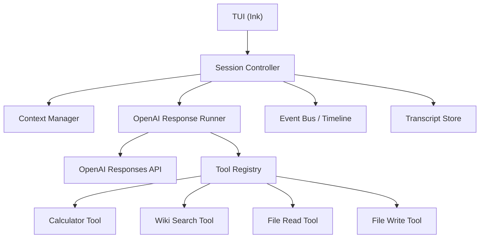

# AI Agent 课程项目推荐方案

基于 [raw-instruction.md](raw-instruction.md) 的作业要求，本文给出一个适合小组落地的推荐方案：构建 `blackpearl-agent`，使用 `TypeScript + Node.js + TUI + OpenAI SDK`，先做终端可运行版本，再逐步扩展到更完整的 Agent 体验。

本文档的设计目标有两个：

1. 满足课程作业的核心要求，不依赖 LangChain、LlamaIndex 这类高层框架。
2. 借鉴 GitHub Copilot 一类产品的技术模式，但保持实现可控、结构清晰、适合教学展示。

参考资料已于 `2026-05-23` 核对，核心依据如下：

- OpenAI 当前推荐新项目优先使用 `Responses API`，而不是从 Chat Completions 起步。
- OpenAI 官方 JavaScript SDK 直接支持 `responses.create(...)`、流式输出、函数工具调用，并可通过 `baseURL` 连接 OpenAI-compatible API。
- GitHub Copilot 相关文档值得借鉴的不是具体产品界面，而是它的几种工程模式：会话隔离、工具受控、上下文管理、事件流可视化、后续可扩展为多 Agent。

## 1. 总体建议

我建议把项目定位成：

**一个终端里的教学型 AI Agent Runtime**

它像一个简化版的 Copilot Agent：

- 用户在 TUI 中输入自然语言任务
- Agent 自己决定是否调用工具
- 工具执行结果会回流给模型
- 界面实时展示当前阶段：输入、计划摘要、工具调用、观察结果、最终回答

这个定位有几个好处：

- 很贴合作业的 "会说话" 到 "能做事" 的主题
- 可以自然展示 ReAct / Tool Calling / 多轮循环
- TUI 比 Web 前端更快起步，更容易把精力集中在 Agent 核心
- 后续加分项如流式输出、记忆、多 Agent，都能在同一架构上增量实现

## 2. 推荐技术栈

### 核心栈

- `Node.js 20+`
- `TypeScript`
- `OpenAI Node SDK`
- `Responses API`
- `Ink` 作为 TUI 框架
- `Zod` 做运行时参数校验
- `pnpm` 作为包管理器

### 推荐依赖

- `openai`: 官方 SDK
- `ink`: React 风格 TUI
- `react`: Ink 依赖
- `zod`: 工具参数校验
- `dotenv`: 环境变量加载
- `mathjs` 或 `expr-eval`: 安全计算器
- `picocolors` 或 `chalk`: 终端配色
- `vitest`: 单元测试

### 为什么这样选

1. `TypeScript` 很适合做工具 schema、事件类型、会话状态管理。
2. `Responses API` 更适合新项目和工具调用场景，官方也明确把它作为新一代 agentic 接口。
3. `Ink` 可以把终端 UI 和核心 Agent 逻辑拆开，后续如果改 Web，也不用推翻 runtime。
4. `Zod + JSON Schema` 可以明显减少工具参数解析错误。

## 3. 借鉴 GitHub Copilot 的方式

这里建议借鉴的是技术模式，不是照着抄产品表面：

### 3.1 会话驱动

每次用户交互都落到一个 `AgentSession` 中，维护：

- 用户输入
- 模型回复
- 工具调用记录
- 工具输出
- 会话摘要
- 当前模式

### 3.2 工具受控

不要让模型直接"随便执行命令"。先把工具封装成白名单：

- `calculator`
- `wiki_search`
- `file_read`
- `file_write`

后续可追加：

- `web_search`
- `task_plan`
- `memory_search`

### 3.3 上下文管理

GitHub Copilot 文档很强调 context window 管理。这个项目也应该从一开始就设计：

- 完整 transcript 本地保存
- 发给模型的是"近期消息 + 关键摘要"
- 工具输出过长时先压缩再回灌

### 3.4 事件流可视化

不要只显示最终答案。TUI 应展示：

- `thinking_summary`
- `tool_call_started`
- `tool_call_finished`
- `assistant_delta`
- `final_answer`

这会让 demo 非常直观，也更像真正的 Agent，而不是普通聊天。

### 3.5 后续可扩展为多 Agent

GitHub Copilot 现在也在强调带作用域的 agent / sub-agent。这个项目的一期不必一上来做复杂多 Agent，但架构上要预留：

- `planner agent`
- `executor agent`

这样后面做加分项时，不用返工。

## 4. 推荐产品形态

### 一期目标

先做一个终端 Agent，支持：

- 多轮对话
- 至少 3 个工具
- 至少 1 个多步任务
- 工具调用过程可见
- 支持流式输出

### TUI 建议布局

```text
+-------------------------------------------------------------+
| Session: agent-demo   Mode: agent   Model: $BLACKPEARL_MODEL |
+--------------------------+----------------------------------+
| Conversation             | Activity                         |
|                          |                                  |
| User: 查一下爱因斯坦...  | plan: 先查维基，再计算寿命      |
| Agent: 正在查询资料...   | tool: wiki_search("Einstein")   |
| Agent: 爱因斯坦生于...   | tool result: 1879-03-14         |
|                          | tool: calculator("1955-1879")   |
|                          | tool result: 76                 |
+--------------------------+----------------------------------+
| Input >                                                    |
+-------------------------------------------------------------+
```

### 建议命令

- `/help`
- `/mode chat`
- `/mode agent`
- `/tools`
- `/history`
- `/clear`
- `/exit`

可选：

- `/approve on|off` 用于控制写文件前是否确认

## 5. 推荐架构



### 分层建议

#### 1. UI 层

负责：

- 终端输入输出
- 流式渲染
- 时间线展示
- 模式切换

不要负责：

- 工具决策
- LLM orchestration
- 业务逻辑

#### 2. Agent Runtime 层

这是项目核心，负责：

- 构造 prompt
- 调用 OpenAI
- 解析 function call
- 执行工具
- 回传 tool output
- 控制循环终止条件

#### 3. Tool 层

每个工具单独成模块，统一接口：

- `name`
- `description`
- `inputSchema`
- `execute(args)`

#### 4. Storage 层

负责：

- 保存 transcript
- 保存 summary
- 保存 demo 结果

## 6. 推荐目录结构

```text
docs/
  raw-instruction.md
  recommended-solution.md

src/
  app/
    tui/
      App.tsx
      InputBox.tsx
      ConversationPane.tsx
      ActivityPane.tsx
      StatusBar.tsx
  agent/
    session.ts
    orchestrator.ts
    prompts.ts
    context-manager.ts
    event-bus.ts
    loop-policy.ts
  llm/
    openai-client.ts
    response-runner.ts
    model-policy.ts
  tools/
    registry.ts
    types.ts
    calculator.ts
    wiki-search.ts
    file-read.ts
    file-write.ts
  storage/
    transcript-store.ts
    summary-store.ts
  shared/
    config.ts
    logger.ts
    errors.ts
  index.ts

tests/
  agent/
  tools/
  integration/
```

## 7. OpenAI 接入方案

### 7.1 API 选择

推荐直接使用 `Responses API`，不要新写项目还从旧的消息拼接模式硬起手。

原因：

- 官方文档把 `Responses API` 定位为更适合 agentic 场景的新接口
- 原生支持工具调用
- 原生支持流式输出
- 更适合后面继续扩展到 MCP、文件检索、更多工具

### 7.2 模型建议

模型名称不要硬编码在业务代码里，统一从环境变量读取：

```text
BLACKPEARL_BASE_URL=...
BLACKPEARL_MODEL=...
BLACKPEARL_SUBAGENT_MODEL=...
BLACKPEARL_API_MODE=responses
```

推荐策略是：

- **日常开发**：选择一个低成本、低延迟的 `mini` 或同级模型。
- **最终演示**：切换到同系列中更强的通用推理模型。
- **课程文档**：只写"可配置模型"，具体模型 ID 以 OpenAI Models 页面和账号实际可用列表为准。

这样做比把某个模型名写死更稳，因为模型列表、默认推荐和账号可用范围都可能变化。

### 7.2.1 多厂商支持边界

这里的“多厂商模型支持”应拆成 provider adapter 支持。OpenAI SDK 可以通过 `baseURL` 指向第三方兼容端点；部分厂商也可能提供 Anthropic-compatible endpoint，例如 DeepSeek 在 Copilot CLI 集成文档中推荐的 `/anthropic` endpoint。

但需要严谨区分三种情况：

- 若厂商兼容 Responses API 与 function calling，使用 `BLACKPEARL_API_MODE=responses`。
- 若厂商只兼容 Chat Completions，使用 `BLACKPEARL_API_MODE=chat_completions`。
- 若厂商提供 Anthropic-compatible endpoint，例如 DeepSeek 的 Copilot CLI 推荐配置，则优先走 Anthropic-compatible adapter。
- 若厂商使用完全不同的原生 API，则需要新增 provider client。

因此，项目文档和代码都应表述为“支持 OpenAI-compatible 多厂商模型服务”，而不是“无条件支持所有厂商模型 API”。

### 7.3 工具调用策略

一期建议：

- 只启用**自定义 function tools**
- `parallel_tool_calls: false`
- 一次优先只走串行工具链

这样做更简单，也更容易解释 ReAct 循环。

### 7.4 一期不要依赖的能力

虽然 OpenAI 现在支持内建工具、远程 MCP 等能力，但一期作业建议先不用它们做主路径，因为：

- 作业重点是自己搭框架
- 自定义工具更能证明你们理解了 "模型如何调用工具"
- 录 demo 更稳定

可以把 `web_search` / `MCP` 作为扩展章节提一下，但不要作为一期必须项。

## 8. Agent Loop 设计

这个项目最关键的是 loop，不是 UI。

### 推荐循环

1. 用户输入自然语言任务
2. 系统 prompt + 最近上下文 + 工具定义发给模型
3. 模型返回：
   - 如果是普通回复，直接结束
   - 如果是 `function_call`，进入工具执行
4. 本地执行工具
5. 把 `function_call_output` 回传给模型
6. 重复直到得到最终答案或达到步数上限

### 终止条件

- 模型给出最终文本答案
- 达到 `maxSteps`，例如 6 或 8
- 工具执行连续失败超过阈值

### 推荐伪代码

```ts
let previousResponseId: string | undefined;
let pendingInput: string | ResponseInputItem[] = userInput;

for (let step = 0; step < maxSteps; step++) {
  const response = await client.responses.create({
    model,
    input: pendingInput,
    previous_response_id: previousResponseId,
    tools,
    parallel_tool_calls: false,
  });

  previousResponseId = response.id;

  const toolCalls = response.output.filter((item) => item.type === "function_call");

  if (toolCalls.length === 0) {
    return response.output_text;
  }

  const toolOutputs = [];

  for (const call of toolCalls) {
    const args = JSON.parse(call.arguments);
    const result = await toolRegistry.execute(call.name, args);

    toolOutputs.push({
      type: "function_call_output",
      call_id: call.call_id,
      output: JSON.stringify(result),
    });
  }

  pendingInput = toolOutputs;
}

throw new Error("Agent exceeded max steps");
```

### 一个重要建议

虽然 `Responses API` 支持通过 `previous_response_id` 延续状态，但**本地仍然要维护自己的 transcript 和 summary**。因为作业里明确要求对话历史管理，这部分最好自己掌握，而不是完全依赖服务端状态。

## 9. Prompt 设计建议

### 原则

不要走脆弱的 "让模型输出固定文本格式，再手写正则解析" 方案。  
既然已经使用 OpenAI 官方工具调用，就让模型直接返回结构化 `function_call`。

### 系统提示词建议

核心约束可以包括：

- 你是一个终端 AI Agent
- 若任务需要计算、检索、文件操作，优先调用工具
- 不要伪造工具结果
- 工具参数必须严格符合 schema
- 若信息不足，先提问或先做可行的下一步
- 最终回答要简洁，说明关键依据

### 关于 ReAct 的建议

作业里提到 ReAct，但不建议把模型完整思维链明文打印出来。更推荐：

- 内部遵循 ReAct 思想
- 外部只展示 `plan summary / action / observation`

这样既保留 Agent 味道，也更现代、更稳。

## 10. 工具设计建议

### 必做 4 个工具

#### 1. `calculator`

作用：

- 执行数学表达式
- 支持加减乘除、括号

注意：

- 不要用 `eval`
- 推荐 `expr-eval` 或安全表达式解析库

#### 2. `wiki_search`

作用：

- 查询百科摘要
- 返回标题、摘要、关键日期、来源链接

建议：

- 支持 `lang` 参数，默认 `en`
- 先做 Wikipedia summary 接口版本

#### 3. `file_read`

作用：

- 读取项目内指定文本文件

注意：

- 限制到工作区内路径
- 控制单次返回长度，避免上下文爆炸

#### 4. `file_write`

作用：

- 在指定输出目录写入文本文件

注意：

- 只允许写入白名单目录，如 `artifacts/` 或 `notes/`
- 默认要求确认，体现受控执行

### 可选扩展工具

- `task_plan`
- `memory_search`
- `web_fetch`
- `project_search`

## 11. 上下文与记忆方案

这是项目里最容易被忽略，但最像真正 Agent 的部分。

### 一期就该有的三层结构

#### 1. 完整记录层

完整保存所有消息、工具调用、工具结果到本地 JSONL。

#### 2. 工作上下文层

真正发给模型的内容只保留：

- system prompt
- 最近几轮对话
- 当前任务相关工具结果
- 一段会话摘要

#### 3. 摘要层

当上下文变长时，把较老内容压成 summary，例如：

- 用户目标
- 已完成步骤
- 重要中间结论
- 已生成文件

### 为什么这样设计

这和 GitHub Copilot 的上下文管理思路是对齐的：  
真正昂贵的是送进上下文窗口的内容，而不是本地存档本身。

## 12. TUI 交互建议

### 推荐模式

#### `chat` 模式

- 默认尽量直接回答
- 不主动做写文件等高权限动作

#### `agent` 模式

- 允许自动调用工具
- 显示更完整的活动轨迹

可选二期：

#### `plan` 模式

- 先给计划
- 用户确认后再执行

### 事件展示建议

每次工具调用在右侧活动面板中展示：

- 工具名
- 入参
- 状态
- 用时
- 输出摘要

这是最能体现 "能做事" 的部分。

## 13. 测试建议

### 单元测试

- `calculator` 参数和计算逻辑
- `wiki_search` 响应解析
- `file_read` / `file_write` 路径约束

### 集成测试

Mock OpenAI 返回：

- 先返回 `function_call`
- 再返回最终答案

验证：

- loop 是否正确
- `function_call_output` 是否正确回传
- 多步任务是否能闭环

### 手工演示测试

至少准备 3 条固定 demo：

1. `查一下爱因斯坦的出生年份，然后算一下他活了多少岁`
2. `读取 docs/raw-instruction.md，并给我总结这个作业的 3 个核心要求`
3. `把上面的总结写入 artifacts/homework-summary.md`

这三条正好覆盖：

- 百科检索
- 多步推理
- 文件读写

## 14. 迭代路线

### Phase 1: 最小可运行版本

- 基础 TUI
- OpenAI SDK 接入
- 3 到 4 个工具
- 单会话 loop
- 非流式输出

### Phase 2: 好用版本

- 流式输出
- 活动时间线
- transcript 持久化
- 上下文摘要

### Phase 3: 展示加分版本

- 双 Agent：planner + executor
- Web UI
- 简单长期记忆
- 可插拔工具发现机制

## 15. 最推荐的实现策略

如果从工程性和作业成功率综合考虑，我最推荐下面这条路线：

### 推荐路线

1. 先把 **Agent Runtime** 做对
2. 再把 **TUI** 做顺
3. 最后加 **流式输出和 summary**

### 不推荐路线

一开始就做复杂前端、复杂多 Agent、复杂联网工具，容易把注意力从作业核心拉走。

## 16. 最终结论

最适合你们这个小组作业的方案是：

**用 TypeScript 在 Node.js 上实现一个名为 blackpearl-agent 的终端优先 Agent 框架，基于 OpenAI 官方 SDK 的 Responses API 做工具调用循环，界面采用 Ink TUI，核心实现围绕 session、tool registry、context manager、event timeline 四个模块展开。**

这条路线有几个关键优势：

- 符合作业要求
- 工程结构清晰
- 便于展示 Agent 的 "思考-行动-观察-回答" 流程
- 很像 GitHub Copilot 的技术思路，但复杂度对课程项目更友好
- 后续扩展空间很好，做加分项时不会推倒重来

## 17. 参考链接

- OpenAI Quickstart: [https://developers.openai.com/api/docs/quickstart](https://developers.openai.com/api/docs/quickstart)
- OpenAI Responses API: [https://developers.openai.com/api/reference/resources/responses/methods/create](https://developers.openai.com/api/reference/resources/responses/methods/create)
- OpenAI Tools Guide: [https://developers.openai.com/api/docs/guides/tools](https://developers.openai.com/api/docs/guides/tools)
- OpenAI Responses Migration Guide: [https://developers.openai.com/api/docs/guides/migrate-to-responses](https://developers.openai.com/api/docs/guides/migrate-to-responses)
- OpenAI Models: [https://developers.openai.com/api/docs/models](https://developers.openai.com/api/docs/models)
- OpenAI Node SDK: [https://github.com/openai/openai-node](https://github.com/openai/openai-node)
- GitHub Copilot Context Management: [https://docs.github.com/en/copilot/concepts/agents/copilot-cli/context-management](https://docs.github.com/en/copilot/concepts/agents/copilot-cli/context-management)
- GitHub Copilot Custom Agents: [https://docs.github.com/en/copilot/how-tos/copilot-sdk/use-copilot-sdk/custom-agents](https://docs.github.com/en/copilot/how-tos/copilot-sdk/use-copilot-sdk/custom-agents)
- GitHub Copilot MCP in Agent Mode: [https://docs.github.com/en/copilot/tutorials/enhance-agent-mode-with-mcp](https://docs.github.com/en/copilot/tutorials/enhance-agent-mode-with-mcp)
